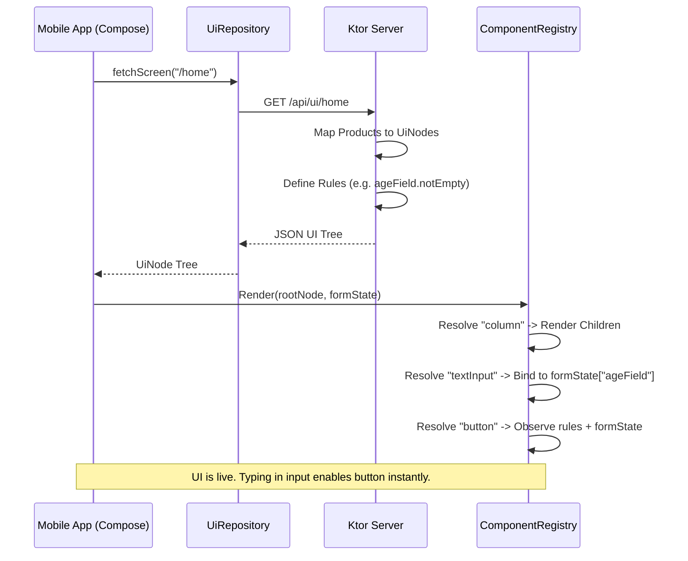

# Project Analysis: SDUI Demo (KMP + Ktor)

This project demonstrates a **Server-Driven UI (SDUI)** architecture using Kotlin Multiplatform for the mobile client (Android/iOS) and Ktor for the backend. It follows the principles of pluggable widgets, server-side data binding, and a client-side rules engine.

## High-Level Architecture

The project is split into three main modules:

1.  **`shared` (The Wire Contract)**: Contains the schema used by both client and server.
2.  **`server` (The Backend)**: Defines the UI layout and binds real data to UI nodes.
3.  **`composeApp` (The Mobile Client)**: Fetches, registers, and renders the UI.

---

## Detailed Component Flow

### 1. The Wire Contract (`shared`)
The `UiNode` is the core building block. It is deliberately generic:
- **`type`**: A simple string (e.g., `"button"`) mapped to a renderer on the client.
- **`props`**: A `JsonObject` containing widget-specific data (e.g., `{"label": "Submit"}`).
- **`rules`**: A list of conditions that control component behavior (e.g., enabled/disabled state).

### 2. Server Execution (`server`)
When the client requests `/api/ui/home`:
- The server performs **Data Binding**: It takes domain objects (like `Product`) and maps them into generic `UiNode` objects with `type = "card"`.
- It defines **Business Logic via Rules**: It attaches a `Rule(whenExpr = "ageField.notEmpty")` to a button.
- It returns a hierarchical JSON tree representing the entire screen.

### 3. Client Execution (`composeApp`)
The client follows a three-step process: **Fetch → Register → Render**.

#### A. Fetching
The `UiRepository` uses Ktor Client to fetch the JSON and deserialize it into the `UiNode` tree.

#### B. Component Registration
The `ComponentRegistry` maintains a map of `type` strings to `@Composable` functions.
- **Pluggability**: You can add new widget types (e.g., `"videoPlayer"`) just by calling `registry.register("videoPlayer") { ... }` without changing the core SDK or server-side contract.

#### C. The Rules Engine
This is the "magic" that makes the UI interactive without constant network calls:
- **`FormState`**: A shared, observable map (`mutableStateMapOf`) that stores values from input fields (like `ageField`).
- **Live Evaluation**: Widgets like `button` observe this state. When a user types in `ageField`, the `button` automatically re-evaluates its rules. If `ageField.notEmpty` becomes true, the button enables instantly.

#### D. Rendering
The `registry.Render(node)` function traverses the tree recursively. Layout nodes (like `column`) render their `children` by calling `Render` again.

---

## The Request-Response Lifecycle

## Key Technical Decisions

- **Generic Props (`JsonObject`)**: Prevents the `shared` module from becoming a "kitchen sink" of every possible widget property.
- **Observable `FormState`**: By using Compose's `mutableStateMapOf`, we get "live" reactivity for free.
- **Stateless Server**: The server defines the *rules*, but the client executes them locally based on user input, ensuring a lag-free experience.
